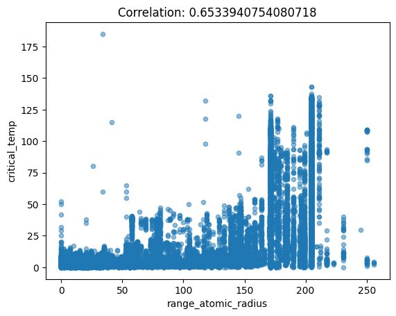
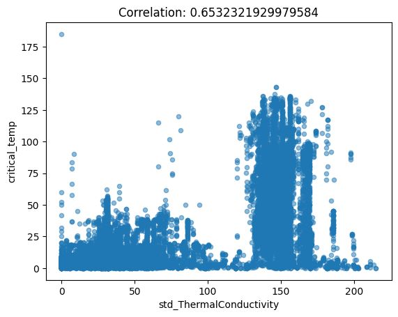

<h2 style="text-align: center;"> Machine Learning </h2>
<h3 style="text-align: center;"> Course Project Report </h3>
<h4 style="text-align: center;"> (Draft - 01, Team No: 01) </h4>

---------------------------------------------------------------

#### Title of the project: Superconductivity Data
    
 
    
__Student 1__: Sarang Galada, sarang.g-25@scds.saiuniversity.edu.in   
__Student 2__: R Sai Pranav Aadhitya, saipranavaadhitya.r-25@scds.saiuniversity.edu.in
    
 
    
#### ML Category: Regression

---------------------------------------------------------------    
 

__1. Introduction__  

- <u>Problem Statement</u>: Superconductivity is the property of certain materials to exhibit zero electrical resistance, ie. ability to conduct direct current electricity without energy loss, when cooled below their critical temperature. Due to its unique advantages, a lot of research has been directed towards superconductivity and its applications. Despite that, the relationship between Critical Temperature (below which the material behaves as a superconductor) and the material’s chemical properties is poorly understood. This has propelled efforts to use Machine Learning techniques to model critical temperature and understand its relationship with the material’s chemical properties.

 

__2. Dataset and Features__

- <u>Details of the dataset</u>: This project makes use of the Superconductivity dataset from University of California, Irvine’s Machine Learning Repository, sourced from Dr. Kam Hamidieh. The dataset consists of 21,263 rows and 82 columns. The rows represent different superconductor compounds (for eg. La2CuO4), while the columns depict various statistical measures of their chemical properties (for eg. mean Atomic Mass, standard deviation of Thermal Conductivity, range of Heat of Fusion and so on). Of these 82 columns, 81 are the input features for our learning model, with the 82nd column (Critical Temperature) being the target variable we wish to predict. 

- <u>Exploratory Data Analysis</u>: As mentioned earlier, the dataset contains 21,263 rows and 82 columns. 

 

  

 

>> Majority of the columns are of type float64, with the exception of two (`number_of_elements`, `range_Valence`), which are of type int64 and hence take discrete values. The dataset doesn’t contain any missing values, although it was found to contain 66 duplicate rows, which had to be dropped as part of data cleaning. 

>> To understand the relationship between the features of the dataset and the target variable `critical_temp`, we make use of scatterplots and correlation matrices. Samples of some scatterplots are shown below: 

 

<!--  

  -->

<figure>
  
   
  
   
  
   
  

 

>> As can be seen, we do not observe distinct linear patterns emerge between the features with `critical_temp`, but in the case of some features, observe an increasing or decreasing trend. The values in the correlation matrix support this fact, as those features show a reasonably high absolute value of correlation with `critical_temp`, indicating some amount of linear dependence. 

 

<!-- 
 -->

<!--    -->
 

__3. Methods__

 

__3.1 Baseline - Linear Regression__

- <u>Brief description of the method</u>: We began by implementing the baseline model, which in this case is a multivariate linear regression model. The data was split into 80% training and 20% testing as is usually recommended, while maintaining reproducibility with a randomness seed value of 42. Upon running this, we got an $R^2$ score of 0.7225 (approx.). We then obtained a cross validation score on the training dataset with 5 folds, which was 0.7173577593955325 +/- 0.009265942222307403. The ~0.9% deviation shows that the model is not very sensitive to small changes in the data, and overall adapts quite well to new instances. 

 

__4. Experiments & Results__

 

__4.1 Protocol__

- <u>Details about splitting into training and testing datasets</u>: The data was split into 80% training and 20% testing, and reproducibility was added with a seed value of 42. 

- What kind of preprocessing was done to the dataset.  
* Data cleaning - The dataset was searched for missing values and duplicates, which were dropped if found.  
* Feature Scaling / Feature Reduction / Feature Selection - (TBD after consulting with Sir)

From the EDA, we notice that most of the columns (about 3/4th) have an absolute correlation above 0.261 with critical_temp upon observing the correlation matrix. We hence decided to apply feature reduction to the dataset in order to boost the speed of computation by removing less relevant features. We hence got the absolute values of the correlation values with `critical_temp`, and eliminated about 25% of the columns that were correlated by less than ~0.261. 

 

__4.2 Results__

- <u>Baseline results</u>: 

- <u>Include tables and figures (plots) for various experiments</u>: 

 

__5. Discussion__

- Not required in first draft

__6. Conclusion__

- Not 